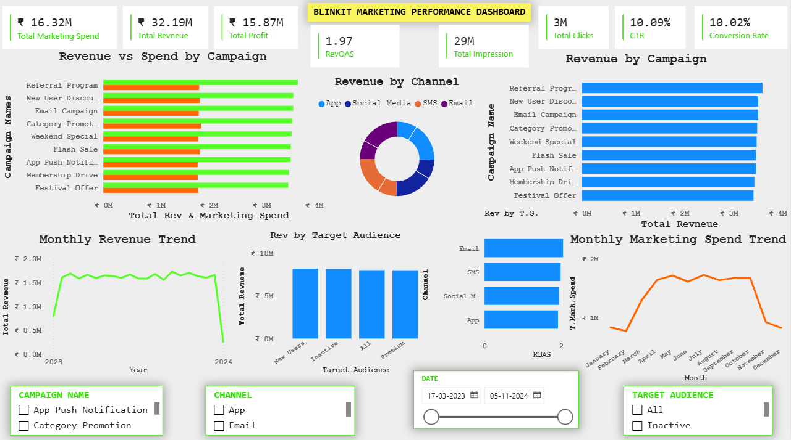

# 📊 Blinkit Marketing Performance Analysis


An end-to-end Business Analytics project that analyzes Blinkit's marketing performance using **SQL**, **Power BI**, and **Excel**. The project identifies high-performing campaigns, marketing channels, target audiences, and business trends to support data-driven marketing decisions.

---

# 📌 Project Overview

This project analyzes Blinkit's marketing campaign performance from **5,400+ records** collected over **2023–2024**.

The objective was to answer key business questions such as:

- Which campaigns generated the highest revenue?
- Which marketing channels performed best?
- Which audience segments contributed the most revenue?
- How efficiently was the marketing budget utilized?
- How did marketing performance change over time?

---

# 🎯 Business Objectives

- Analyze marketing campaign performance.
- Measure Revenue, Profit and ROAS.
- Identify top-performing campaigns.
- Compare marketing channels.
- Analyze target audience performance.
- Build an interactive Power BI dashboard.

---

# 🛠 Tools Used

- Microsoft Excel
- MySQL
- Power BI

---

# 📂 Project Structure

```text
blinkit-marketing-performance-analysis
│
├── 01_Raw_Data
├── 02_Cleaned_Data
├── 03_SQL
├── 04_PowerBI
├── 05_Documentation
├── 06_Image
└── README.md
```

---

# 🗄 SQL Analysis

The SQL analysis includes **35+ business queries** divided into multiple levels:

- Business Overview
- Marketing Performance
- Audience Analysis
- Intermediate SQL
- Business Insights

The analysis covers:

- Revenue
- Marketing Spend
- Profit
- ROAS
- CTR
- Conversion Rate
- Campaign Performance
- Monthly Trends
- Target Audience Analysis

---

# 📈 Power BI Dashboard

The dashboard contains:

## KPI Cards

- Total Marketing Spend
- Total Revenue
- Total Profit
- ROAS
- Total Impressions
- Total Clicks
- CTR
- Conversion Rate

## Visualizations

- Revenue vs Spend by Campaign
- Revenue by Campaign
- Revenue by Channel
- Revenue by Target Audience
- Monthly Revenue Trend
- Monthly Marketing Spend Trend
- Marketing Spend by Channel

## Interactive Filters

- Date
- Campaign
- Channel
- Target Audience

---

# 💡 Key Business Insights

- Referral Program generated the highest revenue.
- Marketing spend of approximately ₹16.32M generated revenue of ₹32.19M.
- Overall ROAS is approximately **1.97x**.
- Revenue is distributed relatively evenly across marketing channels.
- New Users contributed the highest overall revenue.
- Revenue and marketing spend follow similar monthly trends.

---

# 🧠 Skills Demonstrated

- SQL
- Data Cleaning
- Data Analysis
- Business Analytics
- Power BI
- Dashboard Design
- Data Visualization
- Business Storytelling

---

# 📷 Dashboard Preview

> 

---

# 👤 Author

**Yash Chauhan**

- LinkedIn: https://www.linkedin.com/in/yashchan
- GitHub: https://github.com/iamYashChan

---

## ⭐ If you found this project interesting, consider giving this repository a Star.
